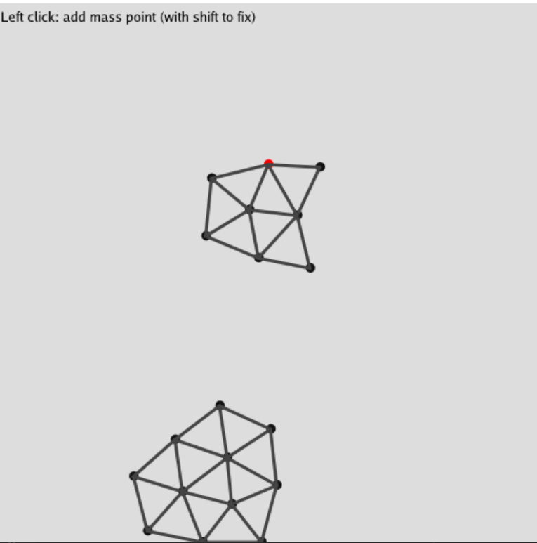

# MassSpringSystem

A simple mass spring system with taichi!

## Build

```bash
pip install taichi
python main.py
```
## Emample
<div>
  
</div>
## Reference

[Chinagraph 2020-用太极编写物理引擎](https://www.bilibili.com/video/BV1UK4y177iH/?spm_id_from=333.999.0.0&vd_source=ea6df38502a795b7533aa33b78bf1159)


